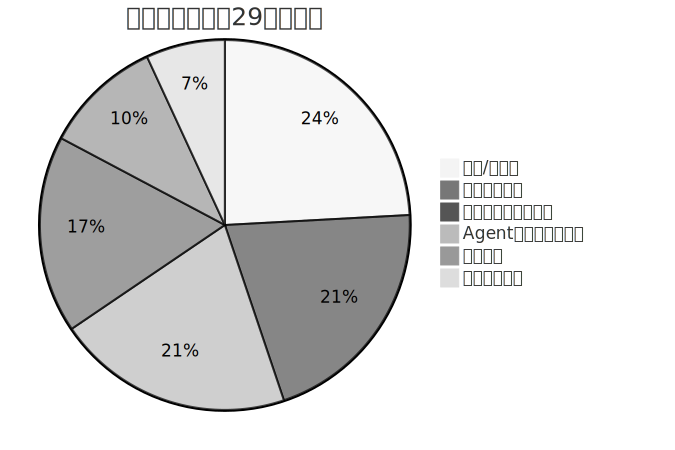
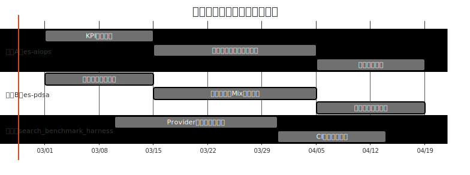

# 过去两个月探索总结与下一步方向（内部详版）

## 0. 结论先行
- 本轮建议确立双旗舰方向：
  - 旗舰1：`es-aiops`（智能诊断 Agent 产品化）
  - 旗舰2：`es-pdsa`（行业雷达与机会优先级）
- 备选方向：`search_benchmark_harness`（评测底座）
- 会议目标：先对齐方向与优先级，下一步再进入季度级资源编排。

---

## 1. 任务定义对照（执行前共识回放）
- 目标：盘点并总结两个月探索成果，形成面向一线与管理层的可分享材料。
- 范围：分析当前目录所有项目；优先读 `md/json`，冲突时再读代码。
- 约束：图表丰富（8+），包含 JSON Canvas 脑图，公开版+内部版双版本。
- 成功标准：
  - 管理层：能快速判断方向是否成立。
  - 一线：能直接拿走方法和执行清单。

---

## 2. 盘点方法与证据边界
### 2.1 方法
1. 全目录清点（顶层目录）。
2. 两个月窗口筛选（2025-12-25 至 2026-02-25）。
3. 项目级证据抽样（README/docs/plan/report/validation 等）。
4. 自动评分初筛 + 人工校准输出 Top2+备选1。

### 2.2 边界说明
- 由于 `mgrep` 配额耗尽（429），采用 `rg/find` 作为本地 fallback。
- 本轮不做“代码细节 correctness 审计”，重点在方向和资产化视角。

### 2.3 覆盖结果
- 顶层目录：32
- 有近两个月 md/json 证据：29
- 无 md/json 证据：3（`_bmad-output`、`docs`、`support-ram`）

---

## 3. 分层观察（从资产角度看）
### 3.1 上游/基线层
- 代表：`elasticsearch`、`kibana`、`kibana-9.2.4`、`kibana-iam`、`elasticsearch-java` 等。
- 作用：技术能力和文档生态基线。
- 局限：规模巨大，直接用于方向汇报信噪比低。

### 3.2 核心技术分支层
- 代表：`es-9.2.4-plugins-*`、`es-8.17-plugins`。
- 作用：承接向量检索、实时性、多分片等核心演进。
- 价值：证明技术链路的可行性与持续迭代能力。

### 3.3 产品演示与集成验证层
- 代表：`es-lance-demo`、`ldap-demo`、`oauth-for-playwright` 等。
- 作用：把“可实现”转为“可演示、可验证、可复现”。
- 价值：面向客户与评审更具说服力。

### 3.4 Agent工程方法与环境层
- 代表：`denny-all-in-one`、`openclaw`、`winter-note`、`_bmad` 等。
- 作用：沉淀技能化流程、脚本规范、经验体系。
- 价值：把个人实践转化为团队可复制方法。

### 3.5 战略探索试点层
- 代表：`es-aiops`、`es-pdsa`（以及备选 `search_benchmark_harness`）。
- 作用：直接服务“方向识别 + 产品价值闭环”。

---

## 4. 旗舰项目深度分析
> 说明：附录C（`appendix/03_旗舰遴选评分说明.md`）记录了“自动评分初筛 + 人工校准”过程；本节 Top2+备选即基于该过程得出。

### 4.1 旗舰1：es-aiops（智能诊断 Agent 产品化）
### 为什么是旗舰
- 文档证据显示：目标、范围、成功标准、门禁策略完整。
- 已建立 model/prompt/context/harness 四层 tuning 思路。
- 有回归与验证导向，具备“持续演进”可操作性。

### 关键证据
- `es-aiops/README.md`：背景、目标、成功标准、交付清单。
- `es-aiops/docs/plans/2026-02-21-es-aiops-agent-implementation.md`
- `es-aiops/docs/plans/2026-02-22-es-aiops-bff-benchmark-implementation.md`
- `es-aiops/docs/appendix-detailed.md`

### 轻量量化估算（假设）
- 假设：按周持续执行调优+门禁，且核心场景覆盖稳定。
- 估算：排障周期改善潜力 `15%~25%`。
- 置信度：中（需要更多稳定周期样本）。

### 4.2 旗舰2：es-pdsa（行业雷达与机会优先级）
### 为什么是旗舰
- 最贴近“方向识别”场景，能直接支撑管理层讨论。
- 已输出 Mix policy、优先目标列表、图表化报告与 JSON Canvas（见 `es-pdsa/openclaw-workspace/radar/README.md` 与 `.../reports/es-industry-radar-latest.md`）。
- 从“信息收集”迈向“可复盘决策输入”。

### 关键证据
- `es-pdsa/openclaw-workspace/radar/README.md`
- `es-pdsa/openclaw-workspace/radar/reports/es-industry-radar-latest.md`
- `es-pdsa/openclaw-workspace/radar/reports/es-industry-radar-latest.json`
- `es-pdsa/docs/agents/LESSONS_LEARNED.md`

### 轻量量化估算（假设）
- 假设：雷达信号质量持续稳定，策略复盘形成固定节奏。
- 估算：有效机会识别率提升 `20%~30%`。
- 置信度：中低（早期样本偏少）。

### 4.3 备选：search_benchmark_harness
- 强项：评测框架体系化，设计/计划/报告链路完整。
- 价值：为 Top2 提供共性评测底座。
- 建议定位：先作为“能力底座备选”，按需求逐步升格。

---

## 5. 面向一线的可执行框架
### 5.1 执行基线
- 固定脚本与固定路径，优先保证可重复与可追踪。
- 每次重要变更后执行回归验证。
- `LESSONS_LEARNED` 持续更新，沉淀“上下文资产”。

### 5.2 两周试运行建议（不新增编制前提）
1. 选定 Top2 各 1 个最小闭环场景。
2. 用固定回归脚本跑通端到端验证。
3. 输出 1 份“证据化周报”并纳入例会。
4. 对齐下一阶段是否升级为正式重点项目。

---

## 6. 风险、假设与控制
### 6.1 关键风险
- 信号噪声导致方向判断偏差。
- 指标定义漂移导致评测结果不可比。
- 脚本/流程分叉导致复现性下降。
- 经验未沉淀导致重复踩坑。

### 6.2 对应控制
- Mix policy + 证据排序。
- benchmark 数据集与指标口径固定。
- start/restart + e2e + specialized regression 固化（执行入口参照 `winter-note/docs/agents/reg_validation_guide.md` 所定义固定脚本：`scripts/agents/start_restart_stack.sh`、`scripts/agents/e2e_validation_regression.sh` 等）。
- 经验文档强制更新（LESSONS_LEARNED）。

---

## 7. 附录与可追踪产物
- 总览导航：`00_总览导航.md`
- 全目录覆盖：`appendix/01_全目录覆盖与证据索引.md`
- 项目卡片总表：`appendix/02_项目卡片总表.md`
- 遴选评分说明：`appendix/03_旗舰遴选评分说明.md`
- 思维脑图：
  - `canvas/01_exploration_strategy_map.canvas`
  - `canvas/02_execution_focus_map.canvas`
