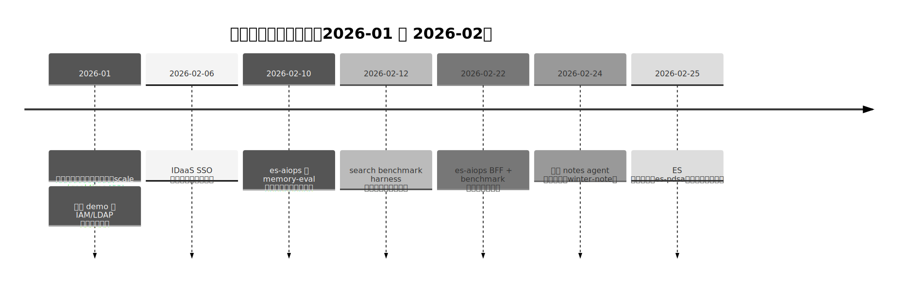
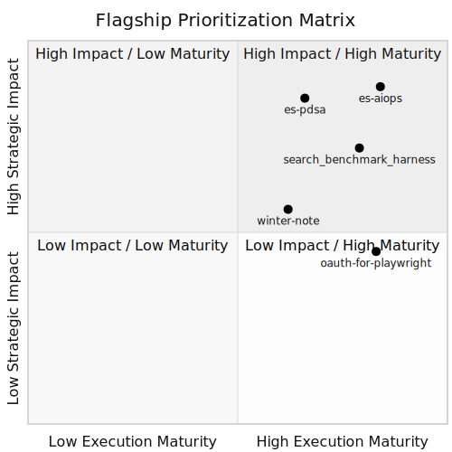
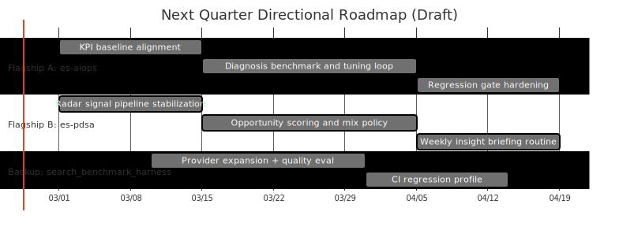
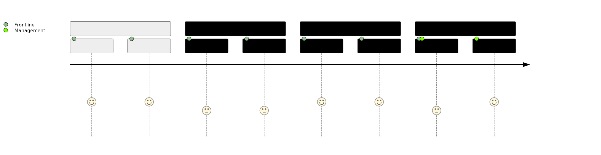

# 过去两个月探索总结与下一步方向（公开版）

## 管理层速览（TL;DR）
- 我们对 `/home/denny/projects` 下 32 个顶层目录进行了盘点，其中 29 个项目存在近两个月的 `Markdown/JSON` 证据；其余 3 个目录（`_bmad-output`、`docs`、`support-ram`）未发现近两月 `md/json` 证据。
- 探索形成了两条主轴：
  - 业务发展与产品功能探索
  - 高效 AI Agent / Vibe Coding 开发环境与最佳实践探索
- 建议方向：
  - 旗舰方向 1：`es-aiops`（智能诊断 Agent 产品化闭环）
  - 旗舰方向 2：`es-pdsa`（行业雷达与机会优先级机制）
  - 备选方向：`search_benchmark_harness`（检索能力基准评测底座）
- 本次会议目标：先形成方向共识，不在本轮强行要求资源承诺。

## 1. 盘点方法与边界
- 盘点范围：`/home/denny/projects` 全目录。
- 数据优先级：优先读取 `md/json`，仅在冲突时才建议进一步读代码。
- 时间窗口：2025-12-25 至 2026-02-25。
- 检索说明：原计划使用 `mgrep` 语义检索，但因配额限制（429）切换到本地 `rg/find` 兜底。

## 2. 主要发现（按主题）
### 2.1 主题A：业务与产品探索逐步从“点状实验”走向“方向化叙事”
- `es-pdsa` 已形成“信号采集→优先级→图表输出→可复盘”闭环雏形。
- `es-lance-demo / ldap-demo / oauth-for-playwright` 等项目积累了“可演示、可验证、可讲述”的落地案例。
- 价值：为管理层讨论“方向是否成立”提供事实抓手，而不只是概念描述。

### 2.2 主题B：Agent工程实践已沉淀出可复制套路
- `es-aiops` 明确了 model/prompt/context/harness 四层 tuning 路径，并把验证与门禁写进流程。
- `search_benchmark_harness` 提供了对检索/实时信息能力的系统化评测框架。
- `winter-note / denny-all-in-one / openclaw` 等项目沉淀了跨端数据组织、技能化工作流、回归脚本与经验固化机制。
- 价值：个人实践正在向“团队可复用的方法资产”迁移。

## 3. Top2 旗舰 + 备选（方向建议）
> 说明：附录C的自动评分中，`oauth-for-playwright` 的 `composite` 分值更高，但经人工校准（战略影响、方向牵引力、长期复用价值）后，本报告将 `es-aiops` 与 `es-pdsa` 定为 Top2，`search_benchmark_harness` 作为备选。

### 3.1 旗舰1：`es-aiops`
- 为什么优先：
  - 目标、范围、成功标准、门禁策略明确。
  - 已具备“诊断→评测→调优→回归”产品化闭环。
  - 与一线执行和管理层价值叙事都高度契合。
- 轻量估算（假设驱动，置信度中）：
  - 若持续按门禁机制推进，有潜力带来 `15%~25%` 的排障周期改善。

### 3.2 旗舰2：`es-pdsa`
- 为什么优先：
  - 对“业务方向识别”最直接，且已经输出图表化雷达报告与优先级列表。
  - 能作为管理层方向讨论的统一输入，降低“凭经验拍脑袋”风险。
- 轻量估算（假设驱动，置信度中低）：
  - 有潜力将有效机会识别率提升 `20%~30%`，需更多周期数据验证。

### 3.3 备选：`search_benchmark_harness`
- 为什么作为备选：
  - 对外部检索能力进行标准化评测，支撑采购、架构与性能决策。
  - 适合作为旗舰方向的“共性能力底座”，随主线节奏逐步扩展。

## 4. 下一季度方向草案（不含资源承诺）
- 方向A（es-aiops）：持续强化可量化诊断质量与回归门禁。
- 方向B（es-pdsa）：稳定行业雷达信号质量，建立周度复盘机制。
- 方向C（备选）：按需求推进 benchmark harness 的 provider 扩展与CI化。

## 5. 面向一线的执行附录（公开可用）
### 5.1 可直接复用的实践模板
- 固定脚本入口与回归编排（start/restart + e2e + specialized validation）。
- 变更后强制回归与文档同步更新。
- `LESSONS_LEARNED` 机制化沉淀，减少重复踩坑。

### 5.2 一线落地最小动作（两周版）
1. 选 1 个场景，用既有脚本跑通一轮“变更→验证→回归”。
2. 选 1 个方向（推荐 es-aiops），补齐目标指标与门禁阈值。
3. 每周固定一次复盘，输出可复用模板和经验条目。

## 6. 风险与控制
- 风险：信号噪声、评测漂移、交付不稳定、经验流失。
- 控制：Mix策略与证据排序、benchmark底座、固定脚本+回归指南、经验强制沉淀。

## 7. 脑图与附录索引
- 思维脑图：`canvas/01_exploration_strategy_map.canvas`
- 执行脑图：`canvas/02_execution_focus_map.canvas`
- 全量覆盖与证据：`appendix/01_全目录覆盖与证据索引.md`
- 项目总表：`appendix/02_项目卡片总表.md`
- 遴选依据：`appendix/03_旗舰遴选评分说明.md`
