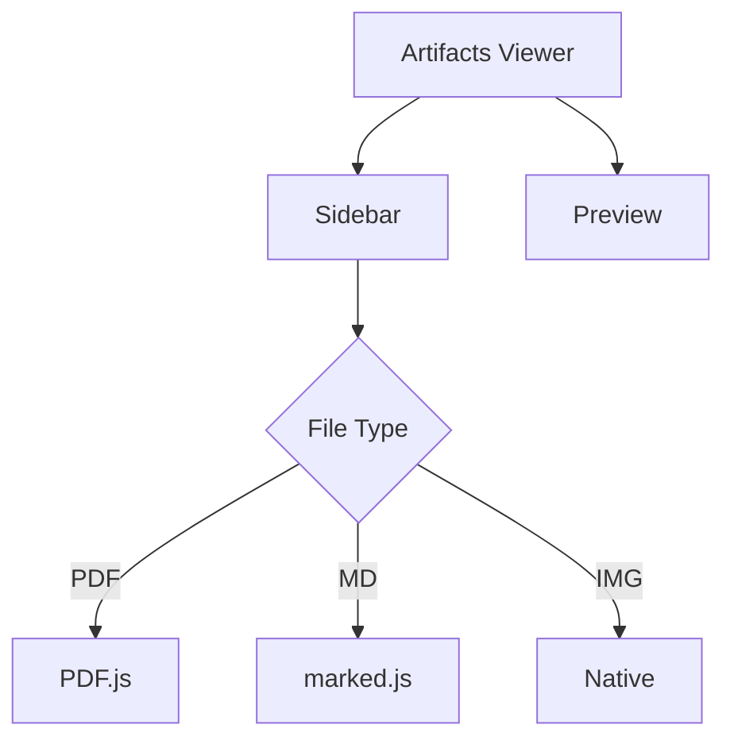

# Welcome to Artifacts Viewer

This is a **lightweight** and **sophisticated** file viewer.

## Features

- 📄 Documents (PDF, DOC, DOCX)
- 📊 Presentations (PPT, PPTX)
- 📝 Markdown with live preview
- 🔀 Mermaid diagrams
- 🖼️ Images (PNG, JPG, SVG, etc.)

## Code Example

```javascript
const viewers = {
  image: { extensions: ['png', 'jpg'] },
  markdown: { extensions: ['md', 'mdx'] },
};
```

## Mermaid Diagram



> Built with ❤️ using vanilla JS
