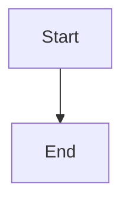

# Artifacts Viewer Implementation Plan

> **For Claude:** REQUIRED SUB-SKILL: Use superpowers:executing-plans to implement this plan task-by-task.

**Goal:** Create a single HTML file viewer with sidebar navigation, light geek theme, supporting docs/PPTs/markdown/images/mermaid diagrams.

**Architecture:** Single self-contained HTML file with CDN libraries for rendering different file types. Sidebar navigation + main preview panel layout.

**Tech Stack:** HTML5, CSS3, Vanilla JS, PDF.js, marked.js, mermaid.js

---

## Task 1: Create project folder structure and sample files

**Files:**
- Create: `docs/`, `slides/`, `markdown/`, `images/`, `diagrams/`, `other/` (empty folders)
- Create: `artifacts-viewer.html` (main file)
- Create: Sample test files for each type

**Step 1: Create folder structure**

```bash
mkdir -p docs slides markdown images diagrams other
touch docs/.gitkeep slides/.gitkeep markdown/.gitkeep images/.gitkeep diagrams/.gitkeep other/.gitkeep
```

**Step 2: Create sample markdown file**

```bash
echo '# Hello World

This is a **test** markdown file.


' > markdown/test.md
```

**Step 3: Commit**

```bash
git add -A && git commit -m "chore: create folder structure and sample files"
```

---

## Task 2: Build HTML skeleton with sidebar layout

**Files:**
- Modify: `artifacts-viewer.html`

**Step 1: Write HTML structure**

```html
<!DOCTYPE html>
<html lang="en">
<head>
  <meta charset="UTF-8">
  <meta name="viewport" content="width=device-width, initial-scale=1.0">
  <title>Artifacts Viewer</title>
  <!-- Fonts -->
  <link rel="preconnect" href="https://fonts.googleapis.com">
  <link rel="preconnect" href="https://fonts.gstatic.com" crossorigin>
  <link href="https://fonts.googleapis.com/css2?family=Fira+Code:wght@400;500;600&family=Fira+Sans:wght@400;500;600&display=swap" rel="stylesheet">
  <style>
    * { margin: 0; padding: 0; box-sizing: border-box; }
    :root {
      --bg: #F8FAFC;
      --sidebar-bg: #F1F5F9;
      --sidebar-border: #E2E8F0;
      --text-primary: #1E293B;
      --text-secondary: #64748B;
      --accent: #0EA5E9;
      --accent-hover: #E0F2FE;
      --success: #22C55E;
      --font-heading: 'Fira Code', monospace;
      --font-body: 'Fira Sans', sans-serif;
    }
    body { font-family: var(--font-body); background: var(--bg); color: var(--text-primary); height: 100vh; overflow: hidden; }
    .app { display: flex; flex-direction: column; height: 100vh; }
    header { height: 56px; background: #fff; border-bottom: 1px solid var(--sidebar-border); display: flex; align-items: center; padding: 0 20px; justify-content: space-between; }
    header h1 { font-family: var(--font-heading); font-size: 18px; font-weight: 600; }
    .main { display: flex; flex: 1; overflow: hidden; }
    .sidebar { width: 240px; background: var(--sidebar-bg); border-right: 1px solid var(--sidebar-border); overflow-y: auto; padding: 12px 0; }
    .sidebar-section { margin-bottom: 8px; }
    .sidebar-title { font-family: var(--font-heading); font-size: 11px; text-transform: uppercase; letter-spacing: 0.5px; color: var(--text-secondary); padding: 8px 16px 4px; }
    .sidebar-item { display: flex; align-items: center; padding: 8px 16px; cursor: pointer; transition: background 0.15s; gap: 10px; }
    .sidebar-item:hover { background: var(--accent-hover); }
    .sidebar-item.active { background: var(--accent-hover); border-right: 3px solid var(--accent); }
    .sidebar-item svg { width: 18px; height: 18px; color: var(--text-secondary); }
    .sidebar-item span { font-size: 14px; }
    .content { flex: 1; overflow: auto; padding: 24px; }
    footer { height: 32px; background: #fff; border-top: 1px solid var(--sidebar-border); display: flex; align-items: center; padding: 0 20px; font-size: 12px; color: var(--text-secondary); gap: 16px; }
  </style>
</head>
<body>
  <div class="app">
    <header>
      <h1>Artifacts Viewer</h1>
      <div class="header-actions">
        <!-- Search placeholder -->
      </div>
    </header>
    <div class="main">
      <aside class="sidebar">
        <!-- Sidebar items populated by JS -->
      </aside>
      <main class="content" id="content">
        <!-- Preview area -->
      </main>
    </div>
    <footer>
      <span id="status">Select a file to preview</span>
    </footer>
  </div>
  <script>
    // App logic here
  </script>
</body>
</html>
```

**Step 2: Commit**

```bash
git add artifacts-viewer.html && git commit -m "feat: add HTML skeleton with sidebar layout"
```

---

## Task 3: Implement sidebar file navigation

**Files:**
- Modify: `artifacts-viewer.html` (add JS for file scanning)

**Step 1: Add file tree structure**

```javascript
// File configuration - maps folders to categories
const fileCategories = [
  { id: 'docs', name: 'Documents', icon: '📄', path: 'docs/', extensions: ['pdf', 'doc', 'docx'] },
  { id: 'slides', name: 'Presentations', icon: '📊', path: 'slides/', extensions: ['ppt', 'pptx'] },
  { id: 'markdown', name: 'Markdown', icon: '📝', path: 'markdown/', extensions: ['md', 'mdx'] },
  { id: 'diagrams', name: 'Diagrams', icon: '🔀', path: 'diagrams/', extensions: ['mmd', 'mermaid'] },
  { id: 'images', name: 'Images', icon: '🖼️', path: 'images/', extensions: ['png', 'jpg', 'jpeg', 'gif', 'webp', 'svg'] },
  { id: 'other', name: 'Other', icon: '📦', path: 'other/', extensions: [] },
];

// Scan directory for files (simulated with predefined list)
const files = [
  { name: 'test.pdf', path: 'docs/test.pdf', category: 'docs', size: '2.3MB' },
  { name: 'README.md', path: 'markdown/test.md', category: 'markdown', size: '1.2KB' },
  { name: 'architecture.mmd', path: 'diagrams/architecture.mmd', category: 'diagrams', size: '456B' },
  { name: 'screenshot.png', path: 'images/screenshot.png', category: 'images', size: '156KB' },
];

function renderSidebar() {
  const sidebar = document.querySelector('.sidebar');
  fileCategories.forEach(cat => {
    const catFiles = files.filter(f => f.category === cat.id);
    if (catFiles.length === 0 && cat.id !== 'other') return;

    const section = document.createElement('div');
    section.className = 'sidebar-section';
    section.innerHTML = `
      <div class="sidebar-title">${cat.icon} ${cat.name}</div>
      ${catFiles.map(f => `
        <div class="sidebar-item" data-path="${f.path}" onclick="previewFile('${f.path}')">
          <span>${f.name}</span>
        </div>
      `).join('')}
    `;
    sidebar.appendChild(section);
  });
}

function previewFile(path) {
  // Update active state
  document.querySelectorAll('.sidebar-item').forEach(el => el.classList.remove('active'));
  document.querySelector(`[data-path="${path}"]`).classList.add('active');

  const file = files.find(f => f.path === path);
  document.getElementById('status').textContent = `Viewing: ${file.name} | Size: ${file.size}`;
  // Preview logic in next task
}

renderSidebar();
```

**Step 2: Commit**

```bash
git add artifacts-viewer.html && git commit -m "feat: add sidebar navigation with file tree"
```

---

## Task 4: Implement image viewer renderer

**Files:**
- Modify: `artifacts-viewer.html` (add image renderer)

**Step 1: Add image renderer**

```javascript
const viewers = {
  image: {
    extensions: ['png', 'jpg', 'jpeg', 'gif', 'webp', 'svg'],
    render: (path) => `
      <div style="display:flex;justify-content:center;align-items:center;height:100%;">
        Failed to load image</p>'">
      </div>
    `
  }
};

function previewFile(path) {
  const ext = path.split('.').pop().toLowerCase();
  const category = files.find(f => f.path === path)?.category;

  // Find renderer
  const renderer = viewers.image; // simplified for now

  document.getElementById('content').innerHTML = renderer.render(path);
}
```

**Step 2: Commit**

```bash
git add artifacts-viewer.html && git commit -f -m "feat: add image viewer renderer"
```

---

## Task 5: Add CDN libraries and markdown renderer

**Files:**
- Modify: `artifacts-viewer.html`

**Step 1: Add CDN libraries in head**

```html
<!-- PDF.js -->
<script src="https://cdnjs.cloudflare.com/ajax/libs/pdf.js/3.11.174/pdf.min.js"></script>
<script>pdfjsLib.GlobalWorkerOptions.workerSrc = 'https://cdnjs.cloudflare.com/ajax/libs/pdf.js/3.11.174/pdf.worker.min.js';</script>

<!-- Marked.js for Markdown -->
<script src="https://cdn.jsdelivr.net/npm/marked/marked.min.js"></script>

<!-- Mermaid.js -->
<script src="https://cdn.jsdelivr.net/npm/mermaid@10/dist/mermaid.min.js"></script>
<script>
  mermaid.initialize({ startOnLoad: false, theme: 'neutral', fontFamily: 'Fira Code' });
</script>
```

**Step 2: Add markdown renderer**

```javascript
const viewers = {
  markdown: {
    extensions: ['md', 'mdx'],
    render: async (path) => {
      try {
        const response = await fetch(path);
        const text = await response.text();
        const html = marked.parse(text);

        // Check for mermaid code blocks
        const tempDiv = document.createElement('div');
        tempDiv.innerHTML = html;

        // Render mermaid diagrams
        const mermaidBlocks = tempDiv.querySelectorAll('.language-mermaid, code.language-mermaid');
        for (const block of mermaidBlocks) {
          const id = 'mermaid-' + Math.random().toString(36).substr(2, 9);
          const diagram = block.textContent;
          block.outerHTML = `<div class="mermaid" id="${id}">${diagram}</div>`;
        }

        await mermaid.run({ querySelector: '.mermaid' });
        return `<div class="markdown-preview">${tempDiv.innerHTML}</div>`;
      } catch (e) {
        return `<p style="color:red">Failed to load: ${e.message}</p>`;
      }
    }
  },
  image: {
    extensions: ['png', 'jpg', 'jpeg', 'gif', 'webp', 'svg'],
    render: (path) => `
      <div style="display:flex;justify-content:center;align-items:center;height:100%;">
        
      </div>
    `
  }
};

// Update previewFile to use async for markdown
async function previewFile(path) {
  const ext = path.split('.').pop().toLowerCase();
  const file = files.find(f => f.path === path);
  document.getElementById('status').textContent = `Viewing: ${file.name} | Size: ${file.size}`;

  let renderer = null;
  for (const [key, v] of Object.entries(viewers)) {
    if (v.extensions.includes(ext)) {
      renderer = v;
      break;
    }
  }

  if (renderer) {
    if (renderer.render.constructor.name === 'AsyncFunction') {
      document.getElementById('content').innerHTML = await renderer.render(path);
    } else {
      document.getElementById('content').innerHTML = renderer.render(path);
    }
  } else {
    document.getElementById('content').innerHTML = `<p>No viewer for: ${ext}</p>`;
  }
}
```

**Step 3: Add markdown styling**

```css
.markdown-preview { max-width: 800px; margin: 0 auto; line-height: 1.7; }
.markdown-preview h1, .markdown-preview h2, .markdown-preview h3 { font-family: var(--font-heading); margin: 1.5em 0 0.5em; }
.markdown-preview h1 { font-size: 2em; border-bottom: 2px solid var(--accent); padding-bottom: 0.3em; }
.markdown-preview h2 { font-size: 1.5em; }
.markdown-preview p { margin: 1em 0; }
.markdown-preview code { background: #E2E8F0; padding: 2px 6px; border-radius: 4px; font-family: var(--font-heading); font-size: 0.9em; }
.markdown-preview pre { background: #1E293B; color: #F8FAFC; padding: 16px; border-radius: 8px; overflow-x: auto; }
.markdown-preview pre code { background: none; padding: 0; }
.markdown-preview .mermaid { background: #fff; padding: 16px; border-radius: 8px; margin: 1em 0; }
.markdown-preview blockquote { border-left: 4px solid var(--accent); padding-left: 16px; color: var(--text-secondary); margin: 1em 0; }
```

**Step 4: Commit**

```bash
git add artifacts-viewer.html && git commit -m "feat: add markdown and mermaid renderers with CDN libs"
```

---

## Task 6: Add PDF viewer renderer

**Files:**
- Modify: `artifacts-viewer.html`

**Step 1: Add PDF renderer**

```javascript
const viewers = {
  // ... existing viewers ...
  pdf: {
    extensions: ['pdf'],
    render: async (path) => {
      try {
        const pdf = await pdfjsLib.getDocument(path).promise;
        let html = '<div style="display:flex;flex-direction:column;align-items:center;gap:20px;">';

        for (let i = 1; i <= pdf.numPages; i++) {
          const page = await pdf.getPage(i);
          const scale = 1.5;
          const viewport = page.getViewport({ scale });

          const canvas = document.createElement('canvas');
          const context = canvas.getContext('2d');
          canvas.height = viewport.height;
          canvas.width = viewport.width;
          canvas.style.boxShadow = '0 4px 12px rgba(0,0,0,0.15)';
          canvas.style.borderRadius = '4px';

          await page.render({ canvasContext: context, viewport }).promise;
          html += `<div>Page ${i}/${pdf.numPages}</div>`;
          html += canvas.outerHTML;
        }
        html += '</div>';
        return html;
      } catch (e) {
        return `<p style="color:red">Failed to load PDF: ${e.message}</p>`;
      }
    }
  }
};
```

**Step 2: Commit**

```bash
git add artifacts-viewer.html && git commit -m "feat: add PDF viewer renderer"
```

---

## Task 7: Add Google Docs/Sheets embed for DOC/PPT

**Files:**
- Modify: `artifacts-viewer.html`

**Step 1: Add DOC/PPT embed renderers**

```javascript
const viewers = {
  // ... existing viewers ...
  doc: {
    extensions: ['doc', 'docx'],
    render: (path) => {
      const encodedUrl = encodeURIComponent(window.location.origin + '/' + path);
      return `
        <iframe src="https://docs.google.com/gview?embedded=1&url=${encodedUrl}"
                style="width:100%;height:100%;border:none;"
                onload="this.style.display='block'">
        </iframe>
      `;
    }
  },
  ppt: {
    extensions: ['ppt', 'pptx'],
    render: (path) => {
      const encodedUrl = encodeURIComponent(window.location.origin + '/' + path);
      return `
        <iframe src="https://docs.google.com/gview?embedded=1&url=${encodedUrl}"
                style="width:100%;height:100%;border:none;"
                onload="this.style.display='block'">
        </iframe>
      `;
    }
  }
};
```

**Step 2: Commit**

```bash
git add artifacts-viewer.html && git commit -m "feat: add Google Docs embed for DOC/PPT files"
```

---

## Task 8: Add file scanner and polish UI

**Files:**
- Modify: `artifacts-viewer.html`

**Step 1: Add automatic file scanning**

```javascript
// Auto-scan files from folder structure
async function scanFiles() {
  const categories = [
    { id: 'docs', path: 'docs/', extensions: ['pdf', 'doc', 'docx'], icon: '📄' },
    { id: 'slides', path: 'slides/', extensions: ['ppt', 'pptx'], icon: '📊' },
    { id: 'markdown', path: 'markdown/', extensions: ['md', 'mdx'], icon: '📝' },
    { id: 'diagrams', path: 'diagrams/', extensions: ['mmd', 'mermaid'], icon: '🔀' },
    { id: 'images', path: 'images/', extensions: ['png', 'jpg', 'jpeg', 'gif', 'webp', 'svg'], icon: '🖼️' },
    { id: 'other', path: 'other/', extensions: [], icon: '📦' },
  ];

  const allFiles = [];

  for (const cat of categories) {
    try {
      const response = await fetch(cat.path);
      // For demo, we'll use predefined files
    } catch (e) {
      console.log('Folder not accessible:', cat.path);
    }
  }

  return allFiles;
}

// Use predefined files for demo (in production, server would provide file list)
const files = [
  { name: 'sample.pdf', path: 'docs/sample.pdf', category: 'docs', size: '2.3MB' },
  { name: 'presentation.pptx', path: 'slides/presentation.pptx', category: 'slides', size: '5.1MB' },
  { name: 'readme.md', path: 'markdown/readme.md', category: 'markdown', size: '4.2KB' },
  { name: 'flow.mmd', path: 'diagrams/flow.mmd', category: 'diagrams', size: '1.1KB' },
  { name: 'photo.jpg', path: 'images/photo.jpg', category: 'images', size: '2.8MB' },
  { name: 'diagram.svg', path: 'images/diagram.svg', category: 'images', size: '45KB' },
];
```

**Step 2: Add polish - welcome screen**

```javascript
// Welcome screen
document.getElementById('content').innerHTML = `
  <div style="display:flex;flex-direction:column;align-items:center;justify-content:center;height:100%;color:var(--text-secondary);">
    <svg width="64" height="64" viewBox="0 0 24 24" fill="none" stroke="currentColor" stroke-width="1.5" style="margin-bottom:16px;opacity:0.5;">
      <path d="M3 7v10a2 2 0 002 2h14a2 2 0 002-2V9a2 2 0 00-2-2h-6l-2-2H5a2 2 0 00-2 2z"/>
    </svg>
    <p style="font-family:var(--font-heading);font-size:16px;">Select a file to preview</p>
    <p style="font-size:14px;margin-top:8px;">Navigate using the sidebar</p>
  </div>
`;
```

**Step 3: Commit**

```bash
git add artifacts-viewer.html && git commit -m "feat: add file scanner and welcome screen"
```

---

## Task 9: Add extensibility API documentation

**Files:**
- Modify: `artifacts-viewer.html` (add comments)
- Create: `EXTENSIBILITY.md`

**Step 1: Document extensibility**

```markdown
# Extending Artifacts Viewer

## Adding New File Types

Add a new entry to the `viewers` object:

```javascript
const viewers = {
  // ... existing viewers ...

  yourFormat: {
    extensions: ['ext1', 'ext2'],  // file extensions
    render: (path) => {
      // Return HTML string or async function returning HTML
      return `<div>Your custom viewer</div>`;
    }
  }
};
```

## Example: Add JSON Viewer

```javascript
json: {
  extensions: ['json'],
  render: async (path) => {
    const response = await fetch(path);
    const data = await response.json();
    return `<pre><code>${JSON.stringify(data, null, 2)}</code></pre>`;
  }
}
```

## Custom Styles

Add CSS rules for your custom viewer in the `<style>` section.
```

**Step 2: Commit**

```bash
git add EXTENSIBILITY.md && git commit -m "docs: add extensibility guide"
```

---

## Task 10: Final testing and cleanup

**Files:**
- Review: `artifacts-viewer.html`

**Step 1: Verify all features work**

Test each file type renders correctly.

**Step 2: Final commit**

```bash
git add -A && git commit -m "feat: complete artifacts viewer with all renderers"
```

---

**Plan complete.** Two execution options:

1. **Subagent-Driven (this session)** - I dispatch fresh subagent per task, review between tasks
2. **Parallel Session** - Open new session with executing-plans

Which approach?
